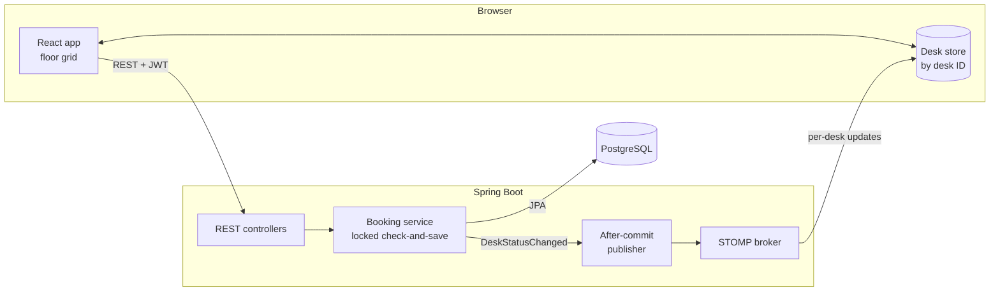

# Architecture

> *Planned.* This describes the agreed design; the code hasn't been scaffolded yet.

## System overview



1. The browser loads a floor snapshot over REST, then subscribes to the floor's WebSocket topic.
2. A booking is a REST call. The booking service locks, checks, and saves it in one transaction.
3. Only after the transaction commits does the publisher send a small per-desk update to every open map.

## Repository layout

```
Smart-Workspace-Seating-Chart/
├── CLAUDE.md               shared rules and the API/WebSocket contract
├── .claude/                Claude Code skills, agents, and shared settings
├── backend/                Spring Boot app (Maven wrapper)
│   ├── CLAUDE.md           backend commands and conventions
│   └── CHANGELOG.md
├── frontend/               React + TypeScript app (Vite)
│   ├── CLAUDE.md           frontend commands and conventions
│   └── CHANGELOG.md
└── docker-compose.yml      PostgreSQL for local development (planned)
```

## Backend

- **Layers:** REST controllers → services → Spring Data JPA repositories.
  - Controllers use DTOs (records) and never expose entities.
  - Services own transactions and all booking rules.
- **Neighbour policy:** one component computes a desk's neighbours from the floor's `neighbour_mode`. Nothing else implements neighbour logic.
- **Booking service:** performs the locked check-and-save described in [[Booking Concurrency]].
- **Error handling:** one `@RestControllerAdvice` maps domain errors and constraint violations to a `{code, message}` body with 400, 403, 404, or 409.
- **Publishing:** a `@TransactionalEventListener(phase = AFTER_COMMIT)` sends updates to `/topic/floors/{floorId}/{date}`.
- **Security:** Spring Security validates the JWT on REST calls and on the STOMP connection.
- **Schema:** Flyway migrations only, including seed data. Never `ddl-auto`.

## Frontend

- **Pages:** login, and a floor page with a date picker and the grid.
- **Store:** desks normalized by desk ID, loaded from the snapshot and patched by socket updates.
- **Grid:** memoized `DeskCell` components. Each cell reads only its own desk.
- See [[Frontend Design]] for details.
