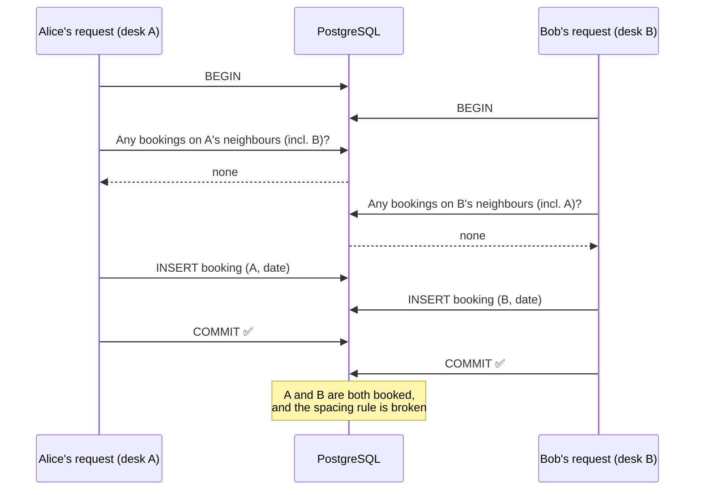
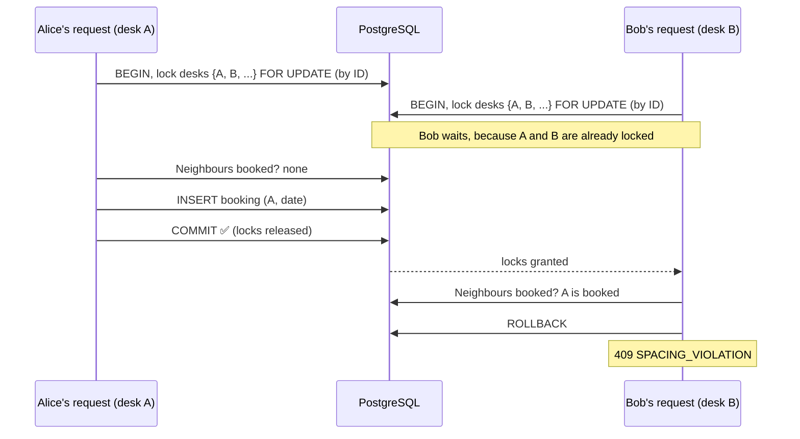

# Booking Concurrency

This page explains the adjacent-seat race and the agreed fix.

## The race (write skew)

Alice books desk **A** and Bob books neighbouring desk **B**, for the same day, at the same moment. Each request checks the neighbours, finds nothing booked, and inserts its own row.

### Why the obvious fixes don't work

- **Unique constraint on `(desk_id, date)`:** it only stops two bookings of the *same* desk. A and B are different desks.
- **Locking only the target desk:** Alice locks A and Bob locks B. The locks don't overlap, so neither waits.
- **`synchronized` or other in-memory locks:** they don't hold across multiple server instances.
- **Default `READ COMMITTED` isolation:** each request reads before the other commits, so neither sees the other's row.

## The fix: lock the target desk and its neighbours

In a single transaction:

1. Load the desk and its floor. Reject non-desk cells and invalid dates.
2. Compute the neighbour desks with the neighbour policy.
3. **Lock the target desk and its neighbours** with `SELECT ... FOR UPDATE`, **in ascending desk-ID order**.
4. Check for bookings on any of those desks for that date:
   - target booked → `409 DESK_TAKEN`
   - a neighbour booked → `409 SPACING_VIOLATION`
5. Insert the booking. If `(user_id, date)` is violated → `409 ALREADY_BOOKED_TODAY`.
6. Take the next `desk_status_seq` value and raise a `DeskStatusChanged` event. It's published only after commit.

Because A and B are neighbours, **both** requests' lock sets include A and B. Whichever gets there first holds the locks, and the other waits.

### Why ascending ID order

If Alice locked A then B, and Bob locked B then A, each could hold one lock and wait forever for the other, which is a deadlock. Locking in a single global order makes that impossible.

### Why lock desk rows, not booking rows

The booking row for the neighbour doesn't exist yet, so there's nothing to lock. The desk rows (`cells`) always exist, which makes them reliable lock targets.

### Alternative

Locking one row per floor and date (for example, a `floor_days` row) also works. It's simpler, but it serializes *all* bookings on that floor for that day, even ones far apart. The per-desk approach only makes nearby bookings wait.

## Defence in depth

The unique constraints on `(desk_id, date)` and `(user_id, date)` stay in place, even though the locks already prevent most violations. A violation that still gets through is caught and returned as a 409, never a 500.

## Proving it

See the concurrency test recipe in [[Testing Strategy]]. A fix isn't done until that test passes repeatedly against real PostgreSQL.
