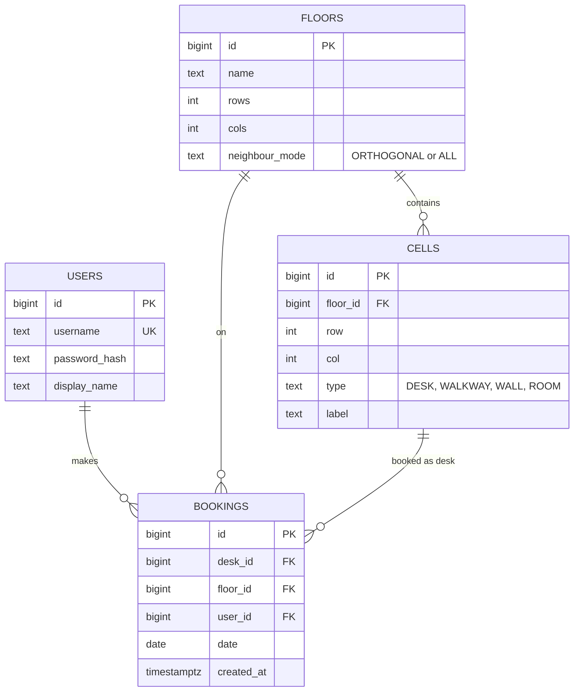

# Data Model

> *Planned.* The schema will be created by Flyway migrations in `backend/src/main/resources/db/migration`.

## Tables

| Table | Purpose | Constraints |
|---|---|---|
| `users` | Employees who can sign in | unique `username` |
| `floors` | A floor's grid size and neighbour mode | `neighbour_mode` in (`ORTHOGONAL`, `ALL`) |
| `cells` | Every cell of a floor's grid, desk or not | unique `(floor_id, row, col)`; `row` and `col` within the floor's size |
| `bookings` | One desk booked by one user for one day | unique `(desk_id, date)`; unique `(user_id, date)`; `desk_id` must point to a `DESK` cell |

## Notes

- **Cancelling deletes the booking row.** That keeps both unique constraints simple, with no need for a "cancelled" status.
- **`floor_id` on `bookings`** is kept alongside `desk_id` so the spacing check and the snapshot can query one floor and date directly.
- **Versioning:** a Postgres sequence, `desk_status_seq`, gives every desk status change (book or cancel) an increasing number called `seq`. The desk rows are locked while they change, so each desk's `seq` values always increase in commit order. Clients use `seq` to drop stale updates. See [[Real-Time Updates]].
- **Seed data** (demo users and a sample floor of about 8×12 cells) is created by a Flyway migration.
- **Indexes:** `bookings(floor_id, date)` for snapshots and spacing checks. The unique constraints cover desk and user lookups by date.
