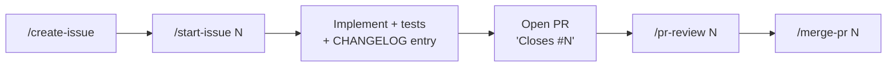

# Development Workflow

## Issue to merge



| Step | Skill | What it does |
|---|---|---|
| File | `/create-issue <description>` | Drafts a bug, feature, or task issue from a template, checks for duplicates, and creates it after you approve |
| Start | `/start-issue <n>` | Reads the issue, assigns you, creates the branch, plans, and implements after you approve |
| Review | `/pr-review <n> [--post]` | Checks the PR against the linked issue and the `CLAUDE.md` rules, then reports findings. Posts them only if you ask |
| Merge | `/merge-pr <n>` | Checks CI, reviews, conflicts, and migration numbers; merges after you confirm; cleans up branches |

All four skills ask before doing anything visible to others: creating issues, posting reviews, or merging.

## Branches

- Branch from `main`, named `<prefix><issue>-<slug>`, for example `fix/12-neighbour-booking-race`.
- Prefixes: `feat/` for features, `fix/` for bugs, `chore/` for scaffolding, tooling, tests, and docs.
- Commit messages or PR descriptions end with `Closes #<n>`.
- Merge with squash by default.

## Changelogs

- Every notable change is recorded under `## [Unreleased]` in `backend/CHANGELOG.md` or `frontend/CHANGELOG.md`, in the same PR.
- Use the [Keep a Changelog](https://keepachangelog.com/en/1.1.0/) sections: Added, Changed, Deprecated, Removed, Fixed, Security.
- Call out API or WebSocket contract changes explicitly.

## Contract changes

The API and WebSocket contract in the root `CLAUDE.md` (and [[API Reference]]) is shared by both sides. A PR that changes it must update the backend, the frontend, and the docs together.

## Database migrations

- Schema changes go only through new Flyway migrations. Never edit one that has been merged.
- Two PRs can add the same `V<n>__` number and both pass CI separately, and `/merge-pr` checks for this.

## Claude Code setup

Start Claude Code from the **repo root** so it finds everything below.

```
CLAUDE.md                 shared rules and contract (loaded at startup)
backend/CLAUDE.md         loaded when working in backend/
frontend/CLAUDE.md        loaded when working in frontend/
.claude/
├── skills/               create-issue, start-issue, pr-review, merge-pr
├── agents/               senior-java-engineer, senior-frontend-engineer, senior-qa-engineer
└── settings.json         shared permissions (committed)
```

### Agents

| Agent | Use for |
|---|---|
| `senior-java-engineer` | Backend features, booking concurrency and locking, JPA/Flyway, WebSocket publishing, backend tests |
| `senior-frontend-engineer` | The grid, desk store, socket handling, optimistic booking, rendering performance, accessibility |
| `senior-qa-engineer` | Test plans, concurrency and end-to-end tests, bug reproduction, verifying a PR before merge |

The QA agent finds and demonstrates problems. It then hands the failing test to the backend or frontend agent as the spec.

### Shared permissions

`.claude/settings.json` does two things:
- **Allowed without asking:** read-only git and `gh` commands, plus the planned build, lint, and test commands.
- **Blocked:** reading `.env` files, force-pushing, `git reset --hard`, and `docker compose down -v`.

Personal settings go in `.claude/settings.local.json`, which is gitignored.
