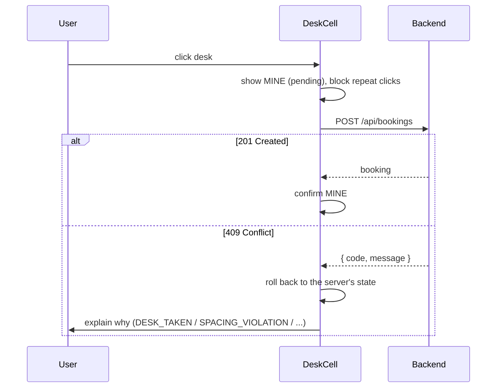

# Frontend Design

> *Planned.* React + TypeScript + Vite in `frontend/`.

## Pages

- **Login:** username and password, which returns a JWT held by the auth module.
- **Floor:** floor picker, date picker, connection indicator, and the grid.

## State

- **Server state** (floors, snapshot, my bookings) is fetched with TanStack Query.
- **The floor store** holds desks **normalized by desk ID**: `{ [deskId]: { status, bookedBy, seq, ... } }`. It's loaded from the snapshot and patched by socket updates, following the rules on [[Real-Time Updates]].
- **Local UI state** (hover, selection, open panels) stays in components, not in the store.

## Desk statuses

| Status | Source | Shown as |
|---|---|---|
| `AVAILABLE` | server | bookable |
| `MINE` | server (booked by me) | my booking, can be cancelled |
| `BOOKED` | server (booked by someone else) | taken, with name |
| `BLOCKED_BY_SPACING` | **worked out on the client** from neighbours and `neighbourMode` | unavailable, with a reason |
| `NOT_A_DESK` | server cell type | walkway, wall, or room |

`BLOCKED_BY_SPACING` is for early feedback only. The server still decides.

## Rendering: only the changed cell redraws

- The grid renders one memoized `DeskCell` per cell, keyed by desk ID.
- Each `DeskCell` reads **only its own desk** from the store through a narrow selector, so an update to desk 101 re-renders only desk 101.
- The status that changes on a neighbour's cell (`BLOCKED_BY_SPACING`) is also computed per cell, so only the booked desk and its neighbours redraw.
- Bursts of updates are batched, for example with `requestAnimationFrame`.
- Status changes animate with CSS transitions, not re-mounts.

## Optimistic booking

- A late response never overwrites newer state; the `seq` rule wins.
- The same socket update that tells other users also confirms your own booking.

## Accessibility

- Cells are real `button`s with arrow-key grid navigation and a visible focus ring.
- Status is never shown by colour alone. Each status also has an icon and a text label, and meets WCAG AA contrast.
- Booking results, conflicts, and "desk just taken by someone else" are announced through an `aria-live` region.

## Security

- Untrusted content is never rendered as HTML.
- The JWT lives only in the auth module and is never logged.
