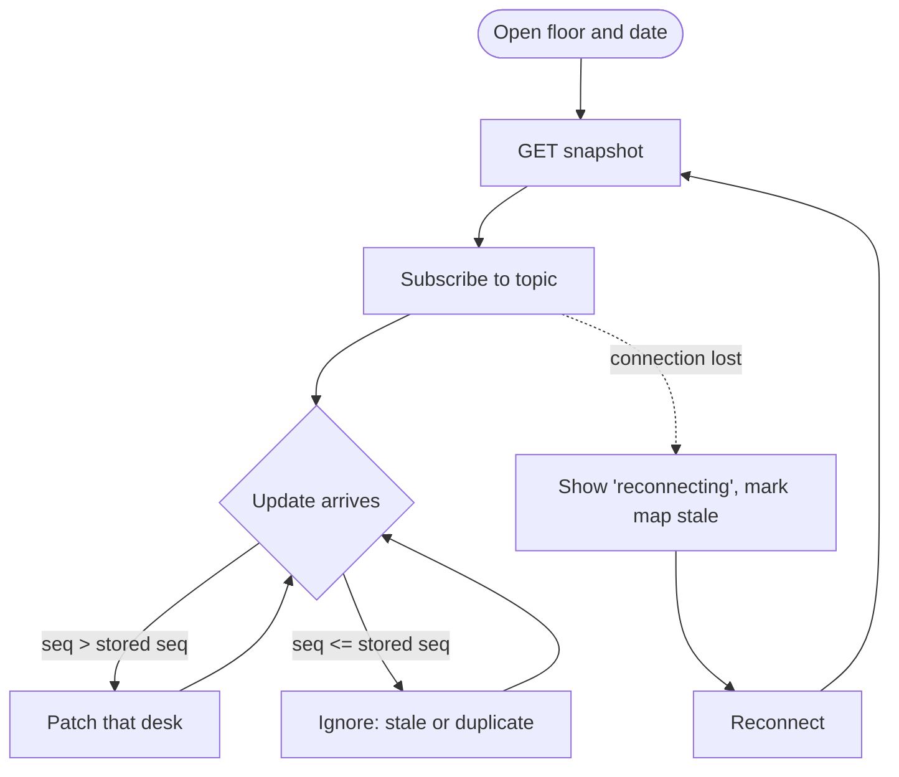

# Real-Time Updates

> *Planned.*

## Transport

- **STOMP over WebSocket**, handled by Spring's WebSocket support on the server and `@stomp/stompjs` in the browser.
- The JWT is checked on the STOMP connection, just like on REST calls.
- **Topic:** `/topic/floors/{floorId}/{date}`. Clients subscribe to the floor and date they're viewing.

## Message

One message per desk change:

```json
{ "deskId": 101, "date": "2026-10-02", "status": "BOOKED", "bookedBy": "Alice", "seq": 1043 }
```

- `status` is `AVAILABLE` or `BOOKED`.
- `seq` comes from the Postgres sequence `desk_status_seq` and increases for every change to a desk.

## Server rules

- **Publish only after commit,** using `@TransactionalEventListener(phase = AFTER_COMMIT)`. A booking that rolls back, for example on a 409, is never broadcast.
- Send only the desk that changed, never the whole floor.

## Client rules



1. **Load, then subscribe.** Load the snapshot, then apply updates.
2. **Drop old updates.** Keep the latest `seq` per desk and ignore any update with a `seq` that isn't greater. This handles messages that arrive out of order or twice.
3. **Resync after reconnecting.** Updates sent while the connection was down are lost, so reload the snapshot every time the socket reconnects.
4. **Show when the map is stale.** While disconnected, show a clear indicator.
5. **Clean up.** Unsubscribe when the floor or date changes, and when the page unmounts.

Updates can arrive during the snapshot request. Subscribe first and buffer messages until the snapshot arrives, then apply the buffered ones using the `seq` rule. Nothing is lost that way.
